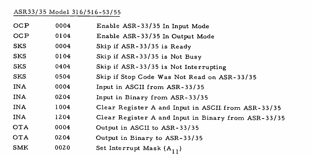
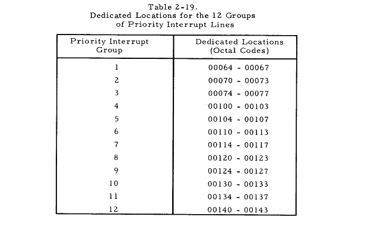
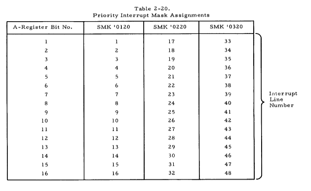
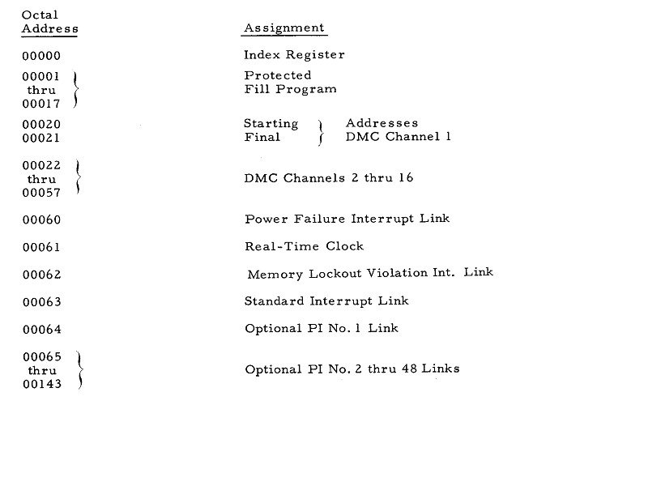
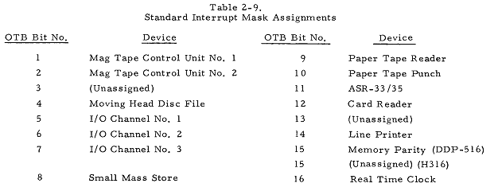
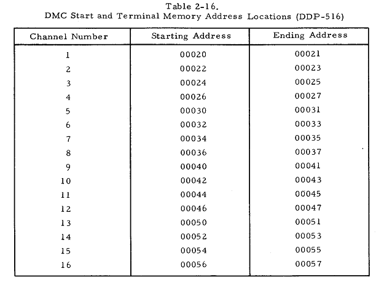

<!-- notpdf -->
# **Summary of I/O Commands for the Arpanet IMP**

***19 Nov 2013***

<!-- /notpdf -->

This document will describe the I/O addresses, commands and interrupts
as currently employed in the IMP 3050 listing from 9/16/1973. This
summary is based on an analysis of the listing and other documents
related to the structure of the IMP.

# **Contents**
 - [<strong>Background</strong>](#background)
 - [I/O instructions](#io-instructions)
 - [<strong>Device Addresses</strong>](#device-addresses)
 - [<strong>Device Descriptions</strong>](#device-descriptions)
 - [<em>Interrupt Unit</em>](#interrupt-unit)
 - [<em>Watch Dog Timer and Status Light Box</em>](#watch-dog-timer-and-status-light-box)
 - [<em>Real Time Clock</em>](#real-time-clock)
 - [<em>Task Interrupt/IMP Number</em>](#task-interruptimp-number)
 - [<em>Modem/Tip Configuration Flag</em>](#modemtip-configuration-flag)
 - [<em>Host Interface</em>](#host-interface)
 - [<em>Modem Interface</em>](#modem-interface)
 - [<strong>Interrupt Entry Point Addresses</strong>](#interrupt-entry-point-addresses)
 - [<strong>Dedicated Locations</strong>](#dedicated-locations)
 - [<strong>Interrupt Masks</strong>](#interrupt-masks)
 - [<strong>DMC Channel Numbers</strong>](#dmc-channel-numbers)

# **Background**

The IMP is based on the Honeywell DDP516 processor. In addition to the
usual complement of peripherals the IMP has been augmented with some
specifically designed cards. At present it is believed that the IMP that
supports the 3050 IMP listing included at least:

-   Honeywell DDP516 (or possibly 316) processor
-   A TTY interface
-   A light panel -- a custom device that indicates the status of the attached lines
-   Real Time Clock -- A custom device that counts 100 usec clock ticks
-   Certain custom "sense" options related to configuration
-   Possibly a custom hardware interrupt to handle task dispatching
-   DMC -- a direct memory controller for transferring words from selected I/O devices to memory

#** I/O instructions**

The DDP516 I/O instructions have the following format:

-   Opcode -- defines the I/O instruction
-   Function Code -- selects a line to pulse (one of 16)
-   Device Code -- address of the device to control

The opcode may be one of:

|**Opcode**  | **Value** |  **Description**|
|------------| ----------|---------------------------------------------------------|
|INA         | 54        |  Input to A-register[^1]|
|OCP         | 14        |  Output Control Pulse as designated by Function Code|
|OTA         | 74        |  Output to device[^2]|
|SKS         | 34        |  Skip if ready line set|
|SMK         | 74        |  Special Mask -- transfer A to interrupt control register|

Where the opcode in the table above is shown as two octal digits, but in
a typical listing the opcode is broken across three octal digits.

# **Device Addresses**

The following device addresses (octal) have been gleaned from the 3050
listing.

|**Address**  | **Device**                                      |
|-------------|-------------------------------------------------|
|04           | TTY                                             |
|20           | Standard Interrupt Unit & Extension             |
|26           | Watchdog Timer and Status Light Box, Proc. Type |
|40           | Real Time 100 usec Clock                        |
|41           | Set task interrupt/IMP Number                   |
|42           | IMP or TIP indicator                            |
|50           | Host Interface 3                                |
|51           | Host Interface 4                                |
|60           | Host Interface 2                                |
|70           | Host Interface 1                                |
|71           | Modem Interface 1                               |
|72           | Modem Interface 2                               |
|73           | Modem Interface 3                               |
|74           | Modem Interface 4                               |
|75           | Modem Interface 5                               |

# **Device Descriptions**

## *Teletype*

The teletype is device address '04'. The following are the macros used
to access the TTY in the listing. It appears that there are provisions
for two TTY units, but only TTY A is used.

|**Instruction**  | **Opcode** |  **FC**| **Dev** |   **Description**|
|-----------------|------------|--------|---------|------------------------------------|
|030004           | OCP        |  00    |   04    |    TTSIM -- set TTY input mode|
|030104           | OCP        |  10    |   04    |    TTSOM -- set TTY output mode|
|070004           | SKS        |  00    |   04    |    TTSRDY -- skip on TTY ready|
|070104           | SKS        |  10    |   04    |    TTSNBZ -- skip on TTY not buzy|
|070504           | SKS        |  05    |   04    |    TTSNSC - Skip if stop code not re|
|                 | INA        |  00    |   04    |    TTINA -- Input in ASCII|
|                 | INA        |  02    |   04    |    TTINB -- Input in Binary|
|131004           | INA        |  10    |   04    |    TTINAC -- get input character|
|131204           | INA        |  12    |   04    |    TTINBC -- Binary input (UNUSED)|
|170004           | OTA        |  00    |   04    |    TTOTA -- Output to TTY|
|170204           | OTA        |  02    |   04    |    TTOTB - Binary output (UNUSED)|

The TTY chart from the DDP519 Programmers' Reference Manual (page D-3):

## *Interrupt Unit*

Device address '20' is used to set interrupt masks per the SMK
instruction. The function code controls which bank of interrupts is to
be set from the A register. In addition to the standard interrupt level
the IMP apparently includes the next interrupt level the IMP includes an
extension to allow interrupts on lines 1-16. This probably is where the
"task" interrupt enters the system.

|**Instruction**  | **Opcode** |  **FC**| **Dev** |   **Description**|
|-----------------|------------|--------|---------|------------------------------------------------|
|170020           | OTA        |  00    |   20    |    SMK -- set "standard" interrupt mask|
|170120           | OTA        |  00    |   20    |    SMK -- set extension interrupt mask lines 1-|

## *Watch Dog Timer and Status Light Box*

Presently the exact structure of this unit is unknown. It appears that
the watch dog timer (WDT) generates an interrupt if it is not given an
OCP pulse at periodic intervals (interval unknown). The light box
appears to be 16 lights controlled by a register and is used to display
modem and host status (see listing \@3355). There is an SKS function at
this address, which appears to be a bit that indicates the type of
processor. This function is defined, but is not used in the code.

| **Instruction** | **Opcode** | **FC** | **Dev** | **Description**        |
|-----------------|------------|--------|---------|------------------------|
| 030026          | OCP        | 00     | 26      | Reset watch dog timer  |
| 170026          | OTA        | 00     | 26      | Set status lights      |
| 070026          | SKS        | 00     | 26      | AMI512 -- machine type |
|                 |            |        |         | -   0 = Other (316??)  |
|                 |            |        |         | -   1 = 516            |

## *Real Time Clock*

This appears to be a custom hardware that counts 100 usec pulses. From
analysis of the code it appears that the RTC interrupt, CLOKIL, occurs
on the carry of the eighth bit. This would correspond to 25.600 msec. It
appears that the clock can only be read and that it is initialized to
zero on power up. Not sure whether the clock counts up or down.

|**Instruction**  | **Opcode** |  **FC**| **Dev** |   **Description**|
|-----------------|------------|--------|---------|--------------------------------|
|030040           | OCP        |  00    |   40    |    CLKON -- turn clock on|
|031040           | OCP        |  10    |   40    |    CLKOFF -- stop real time clock|
|131040           | INA        |  10    |   40    |    RDCLOK -- read current time|

## *Task Interrupt/IMP Number*

This appears to be a control pulse that can be used to set an external
interrupt to indicate that a task has been posted to the task queue. The
IMP number appears to be a hardwired number of the particular IMP.

|**Instruction**  | **Opcode** | **FC**| **Dev** |  **Description**|
|-----------------|------------|-------|---------|----------------------------------------|
|030041           | OCP        |  00   |   41    |    TASK -- set task interrupt          |
|131041           | INA        |  10   |   41    |    RDIMPN -- probably hardwired IMP number|

The RDIMPN instruction is a form of the INA instruction. If the IMP
number is not available the code executes the next instruction. If the
IMP number is available the next instruction is skipped. Presumably the
IMP number is always available.

## *Modem/Tip Configuration Flag*

Allows the code to determine if the machine is an IMP or a TIP
(Multi-Line Controller).

| **Instruction** | **Opcode** | **FC** | **Dev** | **Description**  |
|-----------------|------------|--------|---------|------------------|
| 070042          | SKS        | 00     | 42      | AMIMLC[^3] --    |
|                 |            |        |         | -   0 = IMP      |
|                 |            |        |         | -   1 = MLC  (Multi Line Controller)  |

## *Host Interface*

As shown above the host device addresses are not sequential probably
because there are other important Honeywell devices already assigned to
this area. In the following x is the device number that may vary from 1
to 4. The actual device address is shown above. MIDAS macros on page 4
of the listing show the construction of host instructions.

It appears that these controls go to the host interface. Data for the
host is transferred through DMC channels.

|**Instruction**  | **Opcode** |  **FC**|   **Description**                                       |    **Listing**|
|-----------------|------------|--------|---------------------------------------------------------|-------------|
|303060           | OCP        |  00    |   HxROUT -- Host "regular" output -- start output to hos|t   17056|
|030170           | OCP        |  01    |   HxIN -- start host input                              |    13200|
|030270           | OCP        |  02    |   HxFOUT -- Host final output -- final output to host   |    16124|
|030370           | OCP        |  03    |   HxXP -- Cross patch host (see listing p. 179)         |    \-\--|
|030470           | OCP        |  04    |   HxUNXP -- un-Cross patch host (see listing p. 179)    |    01170|
|030570           | OCP        |  05    |   HxENAB -- Enable host ??                              |    16316|
|070070           | SKS        |  00    |   HxERR -- skip on host error                           |    13172|
|070071           | SKS        |  01    |   HxRDY -- skip on host ready                           |    21664|
|070072           | SKS        |  02    |   HxEOM -- skip on host end-of-message (UNUSED ??)      |    13303|
|070075           | SKS        |  04    |   HxFULL -- skip on host buffer full ?? (UNUSED ??)     |    \-\--|

## *Modem Interface*

The following controls go to the modem (M1, M2, M3, M4, M5). The actual
data is transferred through the DMC. Modem addresses are given in the
table above. Instruction codes are examples for particular modems. Page
4 of the listing gives the macros used to generate the instructions.

|**Instruction**  | **Opcode** |  **FC**|   **Description**                                       |    **Listing** |
|-----------------|------------|--------|---------------------------------------------------------|-------------|
|030071           | OCP        |  00    |   MxOUT -- start modem output                           |    01062|
|030171           | OCP        |  01    |   MxUNXP -- un-Cross Patch Modem (see listing p. 179)   |    01266|
|030172           | OCP        |  02    |   MxLXP -- set Line Cross Patch (see listing p. 179)    |    21631|
|030173           | OCP        |  03    |   MxIXP -- set Interface Cross Patch (see listing p. 179)|   21632|
|030471           | OCP        |  04    |   MxIN -- start modem input (see listing p. 179)        |    01223|
|070471           | SKS        |  04    |   MxERR -- Skip on modem error                          |    10052|

# **Interrupt Entry Point Addresses**

It appears that the interrupts vectors for the IMP peripherals have
replaced those associated with the generic DDP 516. The basic interrupt
structure of the DDP 516 is that there are 12 groups of four interrupt
address, starting at 000064 and extending upward in block of four
(probably this is related to packaging of the circuitry). There is a
group "0" of four interrupts from 000060 to 000063, which are fixed.
Here is a table from the Programmer's Reference Manual related to the
interrupt groups:

The IMP uses interrupt groups 1 through 4. As shown below.( these
addresses have not all been verified.)

| **Address** | **MACRO** | **Device**              | **Description**                                                       | **Group** | **Line** |
|-------------|-----------|-------------------------|-----------------------------------------------------------------------|-----------|----------|
| 000060      | PFIL      | Power Fail              |                                                                       |           |          |
| 000061      | SWDTIL    | Watch Dog ??            |                                                                       |           |          |
| 000062      | WDTIL     | Watch Dog ??            |                                                                       |           |          |
| 000063      | STDIL     | Standard Interrupt      |                                                                       |           |          |
| 000064      | M1INTL    | Modem 1 IN              | Modem 1 input ready                                                   | 1         | 1        |
| 000065      | M2INTL    | Modem 2 IN              | Modem 2 input ready                                                   | 1         | 2        |
| 000066      | M3INTL    | Modem 3 IN              | Modem 3 input ready                                                   | 1         | 3        |
| 00067       | M4INTL    | Modem 4 IN              | Modem 4 input ready                                                   | 1         | 4        |
|             | H4OTIL    | Host 4 Out (=M4INTL)    | Host 4 output complete                                                | 1         | 4        |
| 000070      | M5INTL    | Modem 5 IN              | Modem 5 input ready                                                   | 2         | 5        |
|             | H3OTIL    | Host 3 Out (=M5INIL)    | Host 3 output complete                                                | 2         | 5        |
| 000071      | M1OTIL    | Modem 1 OUT             | Modem 1 output complete                                               | 2         | 6        |
| 000072      | M2OTIL    | Modem 2 OUT             | Modem 2 output complete                                               | 2         | 7        |
| 000073      | M3OTIL    | Modem 3 OUT             | Modem 3 output complete                                               | 2         | 8        |
| 000074      | M4OTIL    | Modem 4 OUT             | Modem 4 output complete                                               | 3         | 9        |
|             | H4INIL    | Host 4 IN (=M4OTIL)     | Host 4 input ready                                                    | 3         | 9        |
| 000075      | M5OTIL    | Modem 5 OUT             | Modem 5 output complete                                               | 3         | 10       |
|             | H3INIL    | Host 3[^4] IN (=M5OTIL) | Host 3 input ready                                                    | 3         | 10       |
| 000076      | H1OTIL    | Host 1 Out              | Host 1 output complete                                                | 3         | 11       |
| 000077      | H2OTIL    | Host 2 Out              | Host 2 output complete                                                | 3         | 12       |
| 000100      | H1INIL    | Host 1 IN               | Host 1 input ready                                                    | 4         | 13       |
| 000101      | H2INIL    | Host 2 IN               | Host 2 input ready                                                    | 4         | 14       |
| 000102      | CLOKIL    | Real time clock         | 25.600 msec interrupt ??                                              | 4         | 15       |
| 000103      | TASKIL    | Task ready              | Set dynamically by the program when tasks are added to the task queue | 4         | 16       |

Masking of the interrupts is as shown in the table below (from the
Programmer's Reference Manual). The IMP makes use only of the interrupt
lines 1-16, shown in gray below.

Note that some interrupt locations are assigned to two different devices
(e.g., H4OTIL = M4INIL). These are shown in gray shading above. Certain
configurations of host and modems are not allowed, so these interrupts
will go to the particular device configured. For example, four hosts and
four modems do not appear to be an allowed combination. This allows the
interrupt to be shared. Listing page 43 is probably an enumeration of
allowed host/modem configurations.

# **Dedicated Locations**

The DDP516 has certain low memory locations that area dedicated as shown
in the table below.

# **Interrupt Masks**

Interrupts are organized into four banks. The first bank is standard and
the following three banks are optional. The standard bank appears to be
devoted to standard Honeywell peripherals. In the IMP the second bank is
used to provide interrupts for the modems, host, program and timer. The
table below shows the organization of the interrupt banks in reference
to the set mask instructions that control each bank.

Mask bits in the standard interrupt bank are applied according to the
following table:

The interrupts for the IMP specific devices are related to their device
address as shown in the table of IMP special interrupts. Interrupts for
a particular input are enabled if the bit is set to "0" they are
disabled ("masked") if the corresponding bit is set to 1.

|Address  | Mask Bit |  Function|
|---------|----------|--------------------------|
|000064   | 1        |  Modem 1 IN|
|000065   | 2        |  Modem 2 IN|
|000066   | 3        |  Modem 3 IN|
|000067   | 4        |  Modem 4 IN or Host 4 OUT|
|000070   | 5        |  Modem 5 IN or Host 3 OUT|
|000071   | 6        |  Modem 1 OUT|
|000072   | 7        |  Modem 2 OUT|
|000073   | 8        |  Modem 3 OUT|
|000074   | 9        |  Modem 4 OUT or Host 4 IN|
|000075   | 10       |  Modem 5 OUT or Host 3 IN|
|000076   | 11       |  Host 1 Out|
|000077   | 12       |  Host 2 Out|
|000100   | 13       |  Host 1 IN|
|000101   | 14       |  Host 2 IN|
|000102   | 15       |  Real time clock|
|000103   | 16       |  Task ready|

Note that certain interrupts and interrupt addresses are shared between
modems and hosts. This means that only certain configurations are
allowed. Specifically:

-   5 Modems and 2 Hosts

-   4 Modems and 3 Hosts

-   3 Modems and 4 Hosts

# **DMC Channel Numbers**

The DDP516 supports 16 channels assignments according to the following
table from the Programmer's Reference. Normally, these would be
allocated to various devices, like the tape, printer and disk. However,
the IMP does not include any of these peripherals, so they channel
assignments are freed up for use by the host and modems as shown
following this table.

DMC pointers occur in pairs. For each DMC channel there are two
consecutive words. The first word is the starting address for the
channel and the second word is the ending address. For the modems and
host attached to the IMP the address word pairs are stored as follows.
For each device there is an input and output pointer designated as xx
INBP and xxOTBP, respectively. The pointers for the modem and host DMC
channels are defined on listing page 4 using MIDAS macros.

As with the interrupt address the DMC address for certain hosts and
modems overlap. This is possible because the configurations are limited
and conflicting host and modem configurations are not allowed. For
example, there cannot be 4 hosts and 5 modems. Whether a channel
represents an input or output channel is determined by the structure of
the hardware and by the value of the high bit (bit 1) of the starting
address. A value of "1" indicates the channel is setup for input. A
value of "0" indicates the channel is setup for output.

| Name   | Address | Function                     | Channel | Code Page |
|--------|---------|------------------------------|---------|-----------|
| M1INBP | 000020  | Modem 1 input start address  | 1       | 5         |
|        | 000021  | Modem 1 input end address    | 1       |           |
| M2INBP | 000022  | Modem 2 input start address  | 2       | 5         |
|        | 000023  | Modem 2 input end address    | 2       |           |
| M3INBP | 000024  | Modem 3 input start address  | 3       | 5         |
|        | 000025  | Modem 3 input end address    | 3       |           |
| M4INBP | 000026  | Modem 4 input start address  | 4       | 5         |
|        | 000027  | Modem 4 end start address    | 4       |           |
| M5INBP | 000030  | Modem 5 input start address  | 5       | 5         |
| H4OTBP |         | Host 4 output start address  |         | 6         |
|        | 000031  | Modem 5 input end address    | 5       |           |
|        |         | Host 4 output end address    |         |           |
| M1OTBP | 000032  | Modem 1 output start address | 6       | 5         |
|        | 000033  | Modem 1 output end address   | 6       |           |
| M2OTBP | 000034  | Modem 2 output start address | 7       | 5         |
|        | 000035  | Modem 2 output end address   | 7       |           |
| M3OTBP | 000036  | Modem 3 output start address | 8       | 5         |
|        | 000037  | Modem 3 output end address   | 8       |           |
| M4OTBP | 000040  | Modem 4 output start address | 9       | 5         |
|        | 000041  | Modem 4 output end address   | 9       |           |
| M5OTBP | 000042  | Modem 5 output start address | 10      | 5         |
| H4INBP |         | Host 4 input start address   |         | 6         |
|        | 000043  | Modem 5 output end address   | 10      |           |
|        |         | Host 4 input end address     |         |           |
| H1OTPB | 000044  | Host 1 output start address  | 11      | 5         |
|        | 000045  | Host 1 output end address    | 11      |           |
| H2OTPB | 000046  | Host 2 output start address  | 12      | 5         |
|        | 000047  | Host 2 output end address    | 12      |           |
| H2INPB | 000050  | Host 1 input start address   | 13      | 5         |
|        | 000051  | Host 1 input end address     | 13      |           |
| H2INPB | 000052  | Host 2 input start address   | 14      | 5         |
|        | 000053  | Host 2 input end address     | 14      |           |
| H3OTBP | 000054  | Host 3 output start address  | 15      | 6         |
|        | 000055  | Host 3 output end address    | 15      |           |
| H3INBP | 000056  | Host 3 input start address   | 16      | 6         |
|        | 000057  |                              | 16      |           |

[^1]: Operation of this opcode is complex. The readiness of the device
    is tested before the device is read. If the device is not ready the
    next instruction is executed immediately. If the device is ready the
    data from the device is read into A and the next instruction is
    skipped. This allows the construction of simple ready wait loops.

[^2]: Operation with respect to device ready is similar to above.

[^3]: AMIMLC -- probably means "Am I a Multi-Line Controller?"

[^4]: Only certain configurations of host and modem are allowed, so some
    interrupts overlap.
